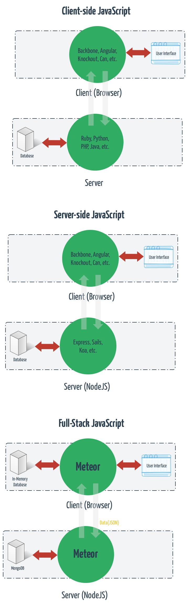
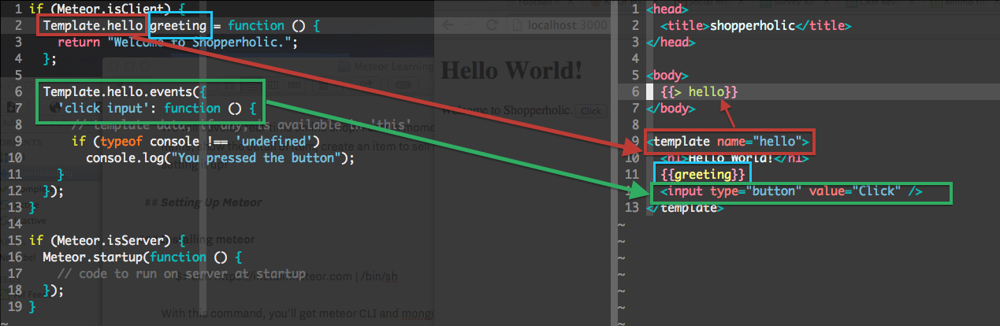

# Building Real-time Shop With Meteor

## Why Meteor?
Easy to learn because you’ll learn less. You just need to learn JavaScript, HTML and CSS. No need to learn Ruby, Python, PHP, etc.

## What is Meteor?

It’s not only framework, it’s a platform. Meteor have their own package manager called atmosphere. At the client side, Meteor has it’s own template engine called blaze. At the server side, it’s NodeJS. It’s fullstack JavaScript platform, perfect for building real-time web apps. It’s reactive and the database available everywhere.

Meteor uses JavaScript on both client and server side. And also able to share between them. Thanks to NodeJS.

## The Project

We will develop real-time online shop. The app will shows list of items, show the detail of item, create an item to sell and able to update it. Now, let’s setting it up!

## Setting Up Meteor

### Installing meteor

	$> curl https://install.meteor.com | /bin/sh

With this command, you’ll get meteor CLI and mongodb installed for you.

### Creating The App

	$> meteor create shopperholic
	$> cd shopperholic

### Running The App

	$> meteor

### Overview of the Code

Now let’s see the code generated by Meteor. 

First we look at the body. There is `{{> hello}}` that will load template called `hello` at the bottom. `hello` template by any chance could be in another file and Meteor still recognise it. 

`{{greeting}}` is variable that bind from javascipt file.